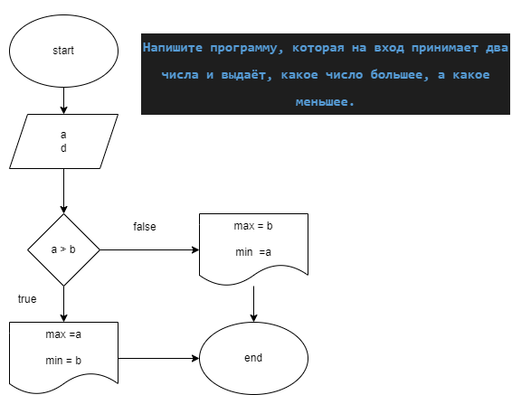
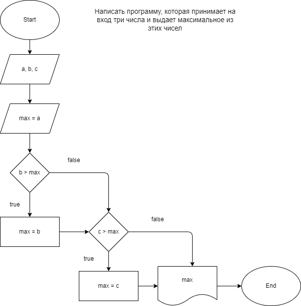
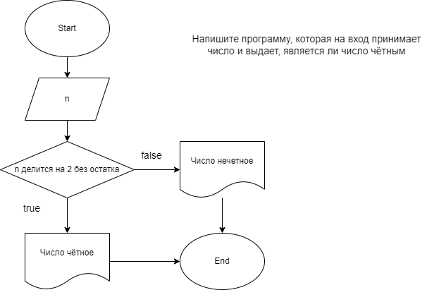
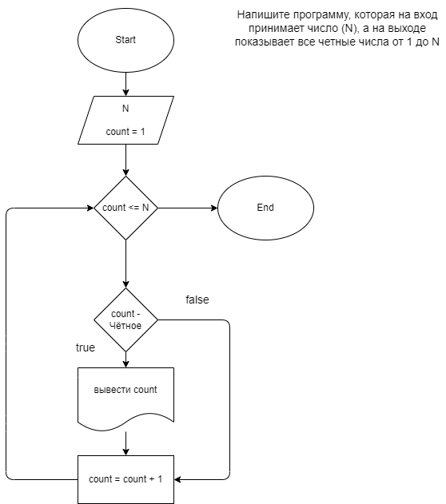
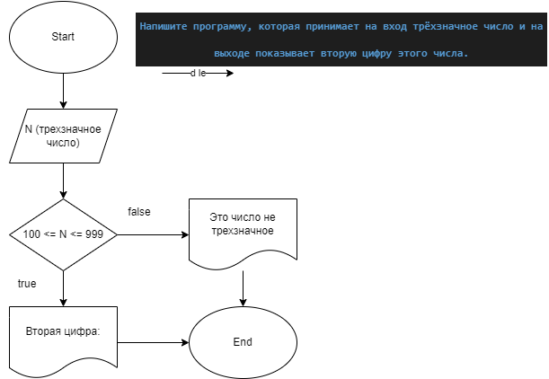
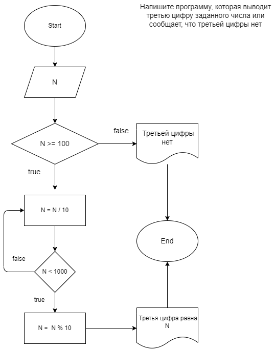
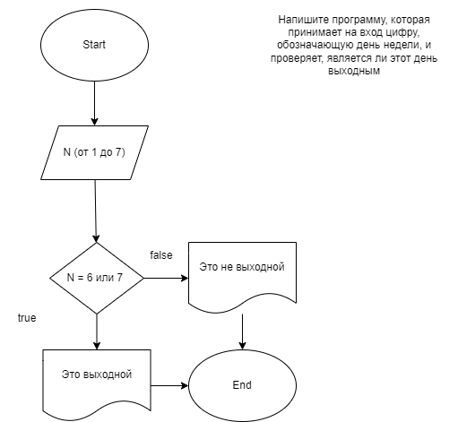

# Создан локальный и удаленный репозитории для выполнения домашних заданиий по теме C#

## Создана папка LESSON1 для заданий по уроку 1

### Задача 2 -  Напишите программу, которая на вход принимает два числа и выдаёт, какое число большее, а какое меньшее.

 [КОД](Lesson1/Ex2/Program.cs)

### Задача 4 -  Напишите программу, которая принимает на вход три числа и выдаёт максимальное из этих чисел.

 [КОД](Lesson1/Ex4/Program.cs)

### Задача 6 -   Напишите программу, которая на вход принимает число и выдаёт, является ли число чётным (делится ли оно на два без остатка).

 [КОД](Lesson1/Ex6/Program.cs)

### Задача 8 -   Напишите программу, которая на вход принимает число (N), а на выходе показывает все чётные числа от 1 до N.

 [КОД](Lesson1/Ex8/Program.cs)

## Создана папка LESSON2 для заданий по уроку 2

### Задача 10 -   Напишите программу, которая принимает на вход трёхзначное число и на выходе показывает вторую цифру этого числа.

 [КОД](Lesson2/Ex10/Program.cs)

### Задача 13 -   Напишите программу, которая выводит третью цифру заданного числа или сообщает, что третьей цифры нет.

 [КОД](Lesson2/Ex13/Program.cs)

### Задача 15 -   Напишите программу, которая принимает на вход цифру, обозначающую день недели, и проверяет, является ли этот день выходным.

 [КОД](Lesson2/Ex15/Program.cs)

## Создана папка LESSON2 для заданий по уроку 3

### Задача 19 -   Напишите программу, которая принимает на вход пятизначное число и проверяет, является ли оно палиндромом

### Задача 21 -   Напишите программу, которая принимает на вход координаты двух точек и находит расстояние между ними в 3D пространстве

### Задача 23 - Напишите программу, которая принимает на вход число (N) и выдает таблицу кубов чисел от 1 до N

